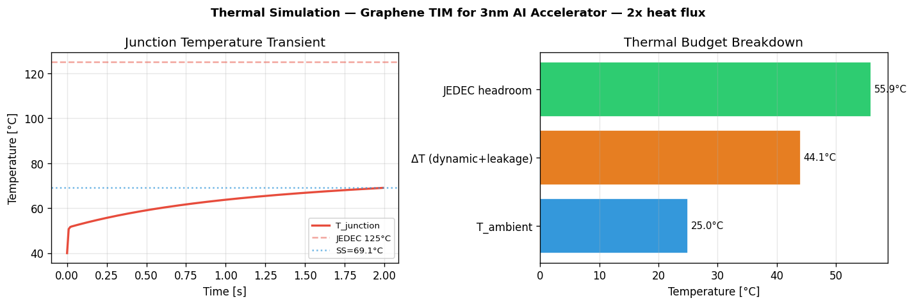
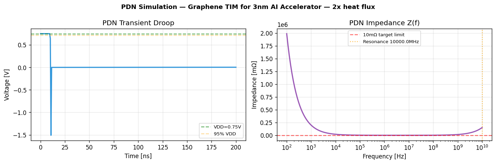

# Simulation Report: Graphene TIM for 3nm AI Accelerator — 2x heat flux improvement

**Idea ID:** `demo-0000-0000-0000-000000000001`  
**Domain:** `thermal`  
**Sim Score:** `3.8/10`  
**Overall Status:** 🔴 `CRITICAL`  
**Timestamp:** 2026-03-18T19:56:06.610107+00:00  
**Duration:** 1424ms

---

## ⛔ Critical Failures

- THERMAL RUNAWAY (TT): no stable operating point. R_theta_critical=0.1541 °C/W, actual=0.199 °C/W
- FF corner: RUNAWAY | R_theta_critical: 0.1541 C/W
- SSN WARNING: timing fails at 75% simultaneous switching
- TIMING VIOLATION at SS corner: slack=-198ps (under PDN droop 3241mV)
- Worst timing: SS corner, slack=-198ps at Vdd=-2.491V

## 🌡 Thermal  ✅ `PASS`

| T_junction SS | **69.1°C** |
| JEDEC margin | **44.7%** |
| Thermal runaway risk | **no** |
| Rise time (90%) | **1372.7ms** |

**Simulation notes:**
> T_j=69.1°C, 44.7% margin
> Leakage: 7.96W (3.2% of total)
> Bottleneck: heatsink→ambient
> 90% thermal rise time: 1373ms
> 2D hotspot @ peak power (431W): 26.54°C (+12.78°C vs avg 13.76°C) at grid(4, 4), gradient=3.26°C/mm

## ⚡ PDN  🔴 `CRITICAL`

| IR drop | **18.0mV** |
| Voltage droop | **3218.0mV (429.1%)** |
| PDN resonance | **10000.0MHz** |
| Recover time | **197407.4ns** |

**Simulation notes:**
> DC IR drop: 18.0mV (2.4% VDD)
> Transient droop: 3218.0mV | Z(1GHz): 15079.445mΩ
> Recovery time: 197407.4ns
> Anti-resonance at 10000.0MHz — PDN noise risk
> SSN WARNING: timing fails at 75% simultaneous switching
> Peak SSN: 46.5mV (100%) | 50%: 23.2mV | budget: 24.7mV
> Z0=1.74mΩ | L_pkg=63pH | C_die=21μF (intrinsic+decap)
> Model: LC tank V=ΔI×sqrt(L/C), 5% effective sync fraction

## 🔋 Electrical  🔴 `CRITICAL`

| P_dynamic | **400.0W** |
| P_leakage | **48.3W** |
| T_equilibrium | **69.1°C** |
| Converged | **yes** |

**Simulation notes:**
> P_dynamic=400.0W | P_leakage=48.3W (10.8% overhead) at T=69°C
> Energy/op is 3.6e+06× Landauer limit — thermodynamic gap
> Power density: 90.0 W/cm²
> TIMING VIOLATION at SS corner: slack=-198ps (under PDN droop 3241mV)
> FF corner adds 34% power overhead — thermal budget must accommodate
> TT: 448.3W total | FF: 602.8W (+34%) | SS: 410.6W
> Worst timing: SS corner, slack=-198ps at Vdd=-2.491V

## 📡 Data Movement  ⚠️ `WARNING`

| Achievable TFLOPS | **2000.0** |
| Efficiency | **100.0%** |
| Bottleneck | **bandwidth** |
| Binding memory | **L2_cache** |

**Simulation notes:**
> 100.0% efficiency, bandwidth-bound (AI=555.6 FLOP/byte)
> Arithmetic intensity: 555.6 FLOP/byte (ridge point: 555.6)
> Binding memory level: L2_cache (inf GB/s)
> Effective latency: 30.0 ns
> NoC utilization=53% — acceptable
> Effective BW: 373 GB/s (90% penalty from 3600 claimed)
> Congestion latency: +17.9ns (base 16.0ns + queue 17.9ns)
> Traffic pattern: attention_pattern (factor=1.8×)
> Memory controller contention: 100% utilization, +3.3ns

---
## Key Simulation Insights

- T_j=69.1°C, 44.7% margin
- Leakage: 7.96W (3.2% of total)
- THERMAL RUNAWAY (TT): no stable operating point. R_theta_critical=0.1541 °C/W, actual=0.199 °C/W
- FF corner: RUNAWAY | R_theta_critical: 0.1541 C/W
- DC IR drop: 18.0mV (2.4% VDD)
- Transient droop: 3218.0mV | Z(1GHz): 15079.445mΩ
- P_dynamic=400.0W | P_leakage=48.3W (10.8% overhead) at T=69°C
- Energy/op is 3.6e+06× Landauer limit — thermodynamic gap
